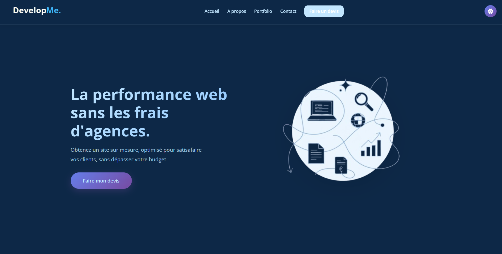

# DevelopMe Paris - Web Developement Agency 

Ce dépôt contient le code d'un site vitrine moderne, conçu pour faire une demande de devis.

Le site est un **front-end pur** (statique) et n'utilise pas de backend traditionnel. L'envoi de formulaire est géré côté client via un service tiers.

**Lien vers le site en ligne :** `https://developme-paris.fr`

---

---

### ✨ Fonctionnalités (Features)

* **Design 100% Responsive :** Entièrement fonctionnel sur mobile, tablette et bureau.
* **Thème Dark Mode :** Un interrupteur pour basculer entre le mode clair et le mode sombre, avec mémorisation du choix de l'utilisateur.
* **Formulaire de Contact Multi-Étapes :** Un formulaire de contact "step-by-step" intuitif qui guide l'utilisateur à travers plusieurs étapes, améliorant l'expérience utilisateur et le taux de conversion.
* **Envoi de Formulaire Sans Backend :** Les demandes de contact sont envoyées directement par e-mail en utilisant `[EmailJS / Formspree / Netlify Forms]` sans nécessiter de serveur.

---

### 💻 Stack Technique

* **Front-End :** `Python -> Flask / HTML`
* **Styling :** `CSS`
* **Formulaire :** `Web3Forms`
* **Hébergement :** `[o2switch]`

---

### 👤 Auteur

* **Adam Laroussi**
* [GitHub](https://github.com/adam-lrssi)
* [LinkedIn](https://www.linkedin.com/in/adam-lrssi)
* [Portfolio](http://portfolio-adam-laroussi.netlify.app/)
